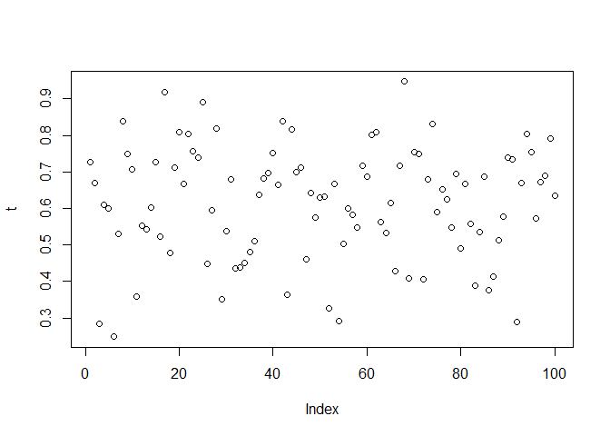
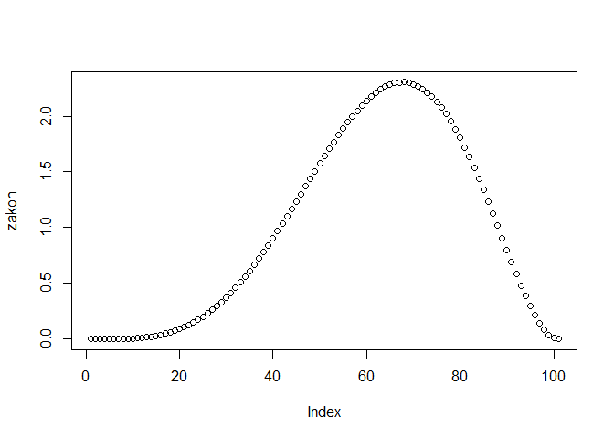
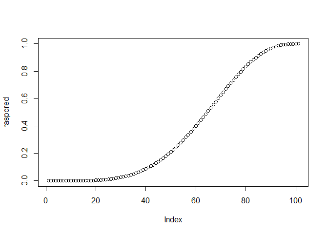
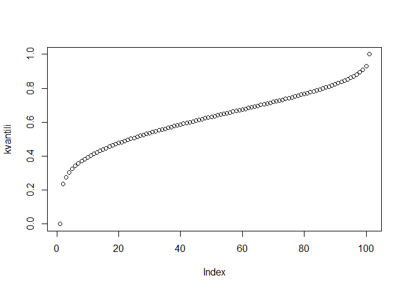
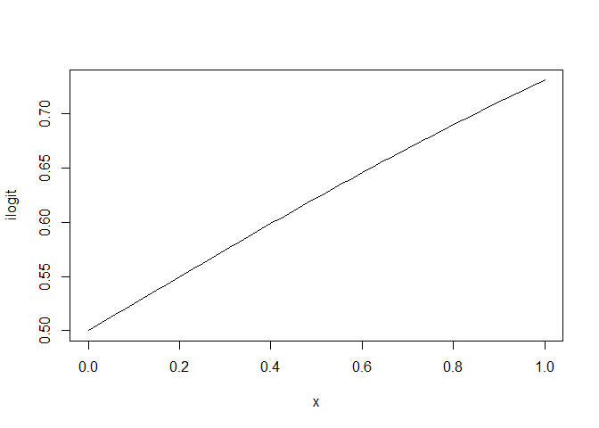

# Instrukcije za upotrebu Shiny aplikacije *Modela Konačne Mešavine*

Dobrodošli u interaktivnu analizu izborne forenzike zasnovanu na
**mešavini tri beta-komponente** (**Bez prevare/Regular**, **Priraštaj
prevare/Incremental fraud**, **Ekstremna prevara/Extreme fraud**) i
**Gausovoj kopuli** koja modelira vezu između izlaznosti (*t*) i udela
glasova (*v*). Aplikacija simulira podatke, zatim u **logit** prostoru
ocenjuje **mešavinu multivarijacionih normalnih rasporeda (korišćenjem
algoritma OM - Očekivanje-Maksimizacija)** i nudi više vizuelizacija i
kriterijuma kvaliteta.

> ***Šta je kopula?***: Kopula je definisana kao funkcija koja povezuje
> multivarijacione funkcije rasporeda sa njihovim jednodimenzionalnim
> marginalnim rasporedima, omogućavajući modeliranje zavisnosti između
> slučajnih promenljivih.  
> ***Šta je Gausova kopula?***: Gausova kopula je definisana kao kopula
> n-dimenzionalne Gausove/normalne slučajne promenljive koju karakteriše
> njen srednji vektor i kovarijaciona matrica, što pruža strukturu
> zavisnosti interpolirajuću između savršene pozitivne i negativne
> zavisnosti na osnovu parametra korelacije.

------------------------------------------------------------------------

## Kako početi (korak-po-korak)

1.  U levom panelu podesite:
    - **Seed** (za reproduktivnost da i drugi mogu proveriti vaše
      rezultate),
    - **Broj tačaka po grupama**: `n1`, `n2`, `n3`,
    - **Parametre Beta raspodele za izlaznost** po grupi:
      `alpha_t (α_t)`, `beta_t (β_t)`,
    - **Korelaciju ρ** (jačina *t–v* veze u grupi).
2.  Kliknite **Pokreni simulaciju**.  
    Aplikacija koristi *debounce* (ignoriše brze duple klikove) i
    *guard* (ne prima novi zahtev dok prethodni traje).
3.  (Opcionalno) otvorite **BIC / ICL analiza** i kliknite **Izračunaj
    BIC/ICL** da biste odabrali broj komponenti (*K*). Računanje je
    **paralelizovano** (više jezgara).
4.  Sačuvajte rezultate:
    - **Preuzmi sirove podatke dobijene simulacijom za izabrani skup
      parametara (CSV)**,
    - **Preuzmi parametre modela koje ste izabrali za vašu simulaciju
      (CSV)**,
    - **Sačuvaj simulaciju (RDS)** / **Učitaj simulaciju (RDS)**
      omogućava ponovno učitavanje ranije generisane simulacije,
    - **Preuzmi PNG/HTML** - preuzima grafike generisane na svakom
      vizuelnom tab-u.

> **Savet:** Dugme **Zaustavi** prekida objavu tekućih rezultata
> (posebno korisno tokom BIC/ICL jer izračunavanje može da potraje
> suviše dugo).  
> **Reset** vraća ulazne parametre na podrazumevane (eng. *default*)
> vrednosti i čisti keš memoriju.

------------------------------------------------------------------------

## Šta rade parametri

- **Beta(α, β) za *t***  
  Očekivana vrednost i varijansa:
  $$
  \mathbb{E}\[t\] = \frac{\alpha}{\alpha+\beta}, \qquad
  \mathrm{Var}(t) = \frac{\alpha\beta}{(\alpha+\beta)^2(\alpha+\beta+1)}.
  $$
  Veći **α** naspram **β** pomera masu ka 1 (viša izlaznost), veći **β**
  naspram **α** ka 0 (niža izlaznost). Manje vrednosti (α,β) ⇒ veći
  rasip/raspršenost tačaka; veće vrednosti ⇒ zbijeniji/kompaktniji oblak
  tačaka.

- **Korelacija ρ (0–0.9)** u Gausovoj kopuli  
  Što je ρ veći, *t* i *v* „šetaju zajedno“ u grupi (visoka izlaznost
  prati visok udeo glasova).

- **Broj tačaka (`n1`, `n2`, `n3`)**  
  Više tačaka ⇒ stabilniji oblici i ocena, ali sporiji proračuni.

> U ovoj demonstraciji parametri za *v* (udeo glasova) su fiksirani po
> grupi radi jasnoće; promenom **ρ** kontrolišete jačinu *t–v* veze, a
> promenom **α\_t, β\_t** „nameštate“ lokaciju i raspršenost *t*.

------------------------------------------------------------------------

## Recepti (postavka parametara) za tipične scenarije

**1) Normalni izbori (Regular dominira)**  
- Regular:
*α**t* = 5, *β**t* = 3, *ρ* = 0.3–0.4, *n*1 = 200  
- Incremental:
*α**t* = 4, *β**t* = 5, *ρ* = 0.4–0.5, *n*2 = 120  
- Extreme:
*α**t* = 2, *β**t* = 7, *ρ* = 0.6, *n*3 = 60

**2) Incremental (postepana) prevara**  
- Regular:
*α**t* = 5, *β**t* = 3, *ρ* = 0.3, *n*1 = 150  
- Incremental:
*α**t* = 4, *β**t* = 4, *ρ* = 0.6–0.7, *n*2 = 140  
- Extreme:
*α**t* = 2, *β**t* = 6, *ρ* = 0.7, *n*3 = 70

**3) Ekstremna prevara**  
- Regular:
*α**t* = 5, *β**t* = 3, *ρ* = 0.2, *n*1 = 120  
- Incremental:
*α**t* = 4, *β**t* = 5, *ρ* = 0.6, *n*2 = 100  
- Extreme:
*α**t* = 7, *β**t* = 2, *ρ* = 0.8–0.9, *n*3 = 80

**Kako „pomaknuti“ lokaciju i rasip** - Podignite prosečnu izlaznost:
povećajte **α\_t** (u odnosu na **β\_t**).  
- Spustite prosečnu izlaznost: povećajte **β\_t** (u odnosu na
**α\_t**).  
- Učinite oblak raspršenijim: smanjite i **α\_t** i **β\_t**.  
- Učinite ga zbijenijim: povećajte **α\_t** i **β\_t**.  
- Istaknite „krak“ ka gornjem desnom uglu (eng. *ballot stuffing*):
povećajte **ρ** u grupi prevare.

------------------------------------------------------------------------

## Kontrole i brz rad

- **Zaustavi (Cancel)**: prekida objavu tekućih rezultata (npr. dok radi
  BIC/ICL).

- **Reset**: vraća ulaze na podrazumevane vrednosti i briše keš (čist
  početak).

- **Sačuvaj simulaciju (RDS) / Učitaj simulaciju (RDS)**: arhiviranje i
  reprodukcija celog stanja.

- **Preuzmi sirove podatke (CSV) i Preuzmi parametre (CSV)**:
  jednostavan izvoz za dalju analizu.

> **Preporuka: menjajte nekoliko (manji broj) parametara odjednom** i
> pratite efekte na „Originalnom prostoru“, „Logit prostoru“ i
> „Entropiji & zakonima verovatnoće“.  
> **Zatim proverite BIC/ICL** kako biste potvrdili da kompleksnost
> modela (broj komponenti) ima smisla za simulirani scenario.

------------------------------------------------------------------------

## Kratki R primeri

#### Beta raspodela – simulacija i osnovne funkcije

Sumuliraj `n=100` uzoraka iz Beta rasporeda:

    set.seed(123)
    t <- rbeta(n=100, shape1 = 5, shape2 = 3)
    mean(t); var(t)  # proveri sredinu i varijansu

    ## [1] 0.6143297

    ## [1] 0.02349986

    plot(t)          # nacrtaj generisanu seriju

Zakon verovatnoće, funkcija rasporeda i kvantili Beta rasporeda:

    x_beta <- seq(0, 1, by = 0.01 )                   # kreiraj vektor
    zakon <- dbeta(x_beta, shape1 = 5, shape2 = 3)    # zakon verovatnoce za beta(5,3)
    plot(zakon)

    raspored <- pbeta(x_beta, shape1 = 5, shape2 = 3) # funkcija rasporeda za beta (5,3)
    plot(raspored)

    kvantili <- qbeta(x_beta, shape1 = 5, shape2 = 3) # kvantili za beta(5,3)
    plot(kvantili)

Logit transformacija (sa „štitom“ za 0 i 1)

    logit <- function(p) {
      eps <- 1e-10
      p <- pmax(pmin(p, 1 - eps), eps)
      log(p/(1 - p))
    }

    x_beta <- seq(0, 1, by = 0.01 )
    ilogit <- function(x_beta) 1/(1 + exp(-x_beta))
    plot(ilogit)

Napomena o kopuli i korelaciji

    # Gaussova kopula: primer generisanja uparenih U(0,1) sa korelacijom rho
    # (u aplikaciji se koristi preko paketa 'copula')
    # library(copula)
    # gaussCop <- normalCopula(rho, dim = 2)
    # u <- rCopula(n, gaussCop)  # dve kolone uniformi ~ U(0,1) sa zadatom korelacijom
