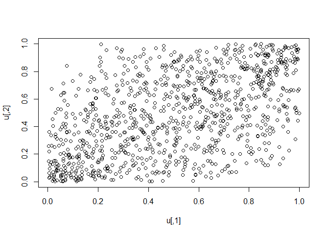
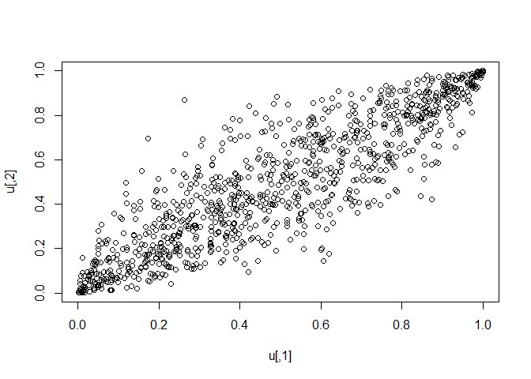

## Zašto logit?

Transformacija $\mathrm{logit}(p) = \log\frac{p}{1-p}$ širi krajeve
(blizu 0 i 1), pa se grupe lakše razlikuju. Algoritam OM
(Očekivanje-Maksimizacija) u logit prostoru bolje „vidi” eliptične
oblike.

## Šta gledate

- Tačke u logit-koordinatama.

- Boje označavaju **OM grupu** nakon poravnanja sa istinitom grupom
  (Grupa1=Regular, Grupa2=Incremental, Grupa3=Extreme).

## Kako čitati

- **Tri eliptična oblaka** su očekivana kada su grupe dobro razdvojene.

- Preklapanje znači težu klasifikaciju (videti i entropiju na poslednjem
  tab-u).

------------------------------------------------------------------------

#### R primer (logit/antilogit)

    logit  <- function(p) { eps <- 1e-10; p <- pmax(pmin(p,1-eps),eps); log(p/(1-p)) }
    ilogit <- function(x) 1/(1 + exp(-x))

#### R primer (skica kopule)

    library(copula)

    rho <- 0.5                    # slabija korelacija
    gaussCop <- normalCopula(rho, dim = 2)
    u <- rCopula(1000, gaussCop)  # U(0,1) sa korelacijom
    plot(u)

    rho <- 0.9                     # visoka korelacija
    gaussCop <- normalCopula(rho, dim = 2)
    u <- rCopula(1000, gaussCop)  # U(0,1) sa korelacijom
    plot(u)

