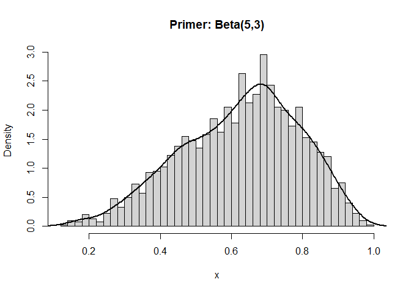

Ovaj tab prikazuje **četiri marginalna rasporeda**: u **originalnom
prostoru** (*t* i *v*) i u **logit prostoru** (*logit(t)* i *logit(v)*).
Svaki graf je **histogram** sa preklopljenom **kernel** ocenom zakona
verovatnoće, što daje i diskretan (histogram) i „uglačan” (KDE) uvid u
oblik rasporeda. KDE (eng. *kernel density estimate*) je ocena zakona
verovatnoće jezgrom.

## Zašto posmatrati marginalne rasporede?

- **Originalni prostor (t, v):** intuitivan, direktno u opsegu
  \[0, 1\].  
- **Logit prostor:** razvlači krajeve ka (−∞, +∞) pa razlike blizu 0 i 1
  postaju uočljivije.  
- Poređenjem ova dva pogleda lakše je videti **asimterije**, „repove” i
  moguće **anomalijske zbijenosti**.

## Kako čitati grafikone

- Histogram daje osećaj **rasporeda mase**, dok KDE otkriva **lokalne
  vrhove** („modove”).  
- Ako je **logit(t)** ili **logit(v)** znatno pomeren ka pozitivnim
  vrednostima, velika je koncentracija blizu 1 u originalu (visoka
  izlaznost/udeo).  
- **Više modova** (vrhova) može ukazivati na mešavinu različitih
  obrasaca (npr. „regularnih” i „sumnjivih” biračkih mesta).

## Povezanost sa parametrima

- Menjanjem **α\_t, β\_t** utičete na **oblik** marginale za *t*.  
- Korelacija **ρ** ne menja margine direktno, ali utiče na zajednički
  raspored (*t–v*), što se „vidi” na drugim tabovima (npr. Logit
  prostor, Entropija i Zakon verovatnoće).  
- Brojevi tačaka **n1, n2, n3** utiču na „stabilnost” procene gustine
  (više tačaka → glađa procena).

------------------------------------------------------------------------

#### R primer: histogram + KDE

    set.seed(1)
    x <- rbeta(2000, shape1 = 5, shape2 = 3)
    hist(x, breaks = 40, freq = FALSE, main = "Primer: Beta(5,3)", xlab = "x")
    lines(density(x), lwd = 2)

